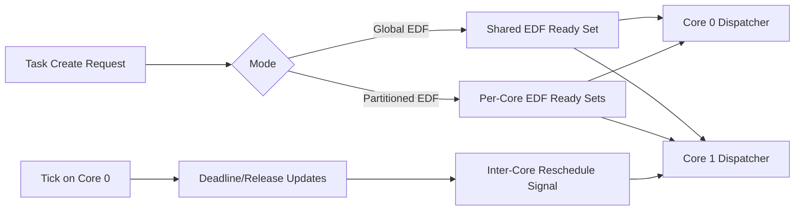

# SMP - Design Document

## 1. Overview

SMP support extends EDF scheduling across both RP2040 cores. The implementation supports two mutually exclusive modes:

- Global EDF: one shared EDF ready set across cores.
- Partitioned EDF: one EDF ready set per core with task-to-core assignment.

Both modes keep the same high-level EDF model (earliest absolute deadline wins), but differ in where admission and placement decisions are made.

## 2. Core Model

### 2.1 Scheduling modes

In global mode, admitted tasks are visible to both cores and can be rescheduled across cores through affinity and migration helpers.

In partitioned mode, each admitted task is attached to one core and contributes to that core's utilization budget.

### 2.2 Admission checks

The scheduler uses utilization-based checks before admitting tasks.

- Global EDF checks total schedulability across all cores.
- Partitioned EDF checks whether at least one core can fit the new task.

Utilization is modeled from WCET and period:

$$
U_i = \frac{C_i}{T_i}
$$

## 3. Scheduling Behavior

### 3.1 Global EDF behavior

Global EDF keeps a shared EDF ordering and lets each core pick eligible earliest-deadline work. This improves balancing but can increase migration and coordination overhead.

### 3.2 Partitioned EDF behavior

Partitioned EDF places tasks on specific cores and schedules them only against local peers. This improves predictability and reduces migration overhead, but can leave one core fuller than the other.

### 3.3 Cross-core reschedule path

Core 0 owns the system tick. When EDF-relevant state changes affect the other core, an inter-core signal requests a reschedule so both cores observe fresh ordering.

## 4. Kernel Integration

### 4.1 Task creation on a core

The SMP API exposes explicit creation with a core preference:

```c
BaseType_t xTaskCreateEDFOnCore(
    TaskFunction_t pxTaskCode,
    const char *pcName,
    configSTACK_DEPTH_TYPE uxStackDepth,
    void *pvParameters,
    TickType_t xPeriod,
    TickType_t xRelativeDeadline,
    TickType_t xWcetTicks,
    BaseType_t xCoreID,
    TaskHandle_t *pxCreatedTask
);
```

### 4.2 Migration and core release

`xTaskMigrateToCore()` and `vTaskRemoveFromCore()` are used to move or unpin tasks while keeping utilization/accounting consistent with the selected mode.

### 4.3 Late-job handling

When an EDF job is late, the kernel advances scheduling state so overdue work does not permanently block future jobs.

## 5. Design Decisions

### 5.1 Why two EDF modes

Global mode is better for dynamic balancing and experimentation. Partitioned mode is better for predictability and easier reasoning per core. Keeping both modes allows testing tradeoffs on the same kernel base.

### 5.2 Why core 0 owns the tick

A single tick owner keeps time progression consistent and avoids dual-tick drift/coordination complexity in this project scope.

### 5.3 Why utilization is tracked in fixed-point units

Fixed-point micro-utilization keeps admission checks deterministic in embedded C without requiring floating-point math in kernel paths.

## 6. System Design Diagram



## 7. Interaction with the Demo Application

The SMP demos validate four practical paths:

- global admission accept/reject,
- global migration behavior,
- partitioned fit/reject behavior,
- partitioned migration behavior after capacity changes.

This keeps the design grounded in observable outcomes, not just internal scheduler state.

## 8. Summary

The SMP design is EDF-first with mode-specific placement:

- global mode shares ready work across cores,
- partitioned mode enforces per-core capacity,
- migration/unpin APIs expose runtime control,
- single-tick plus inter-core signaling keeps both cores synchronized.

This gives the project a clean multiprocessor EDF implementation while preserving the same API-oriented workflow used across the rest of the assignment.
