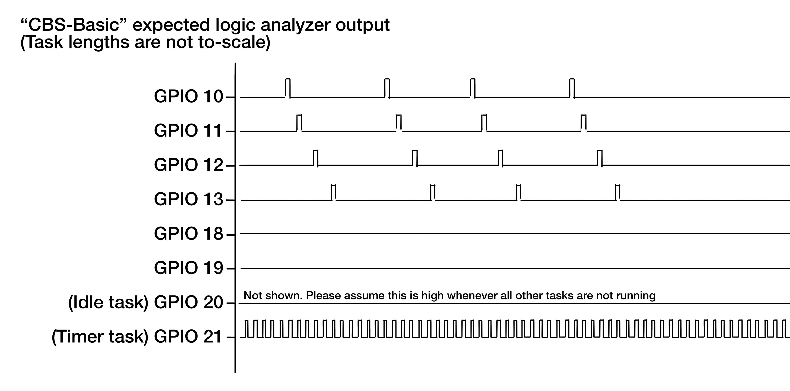
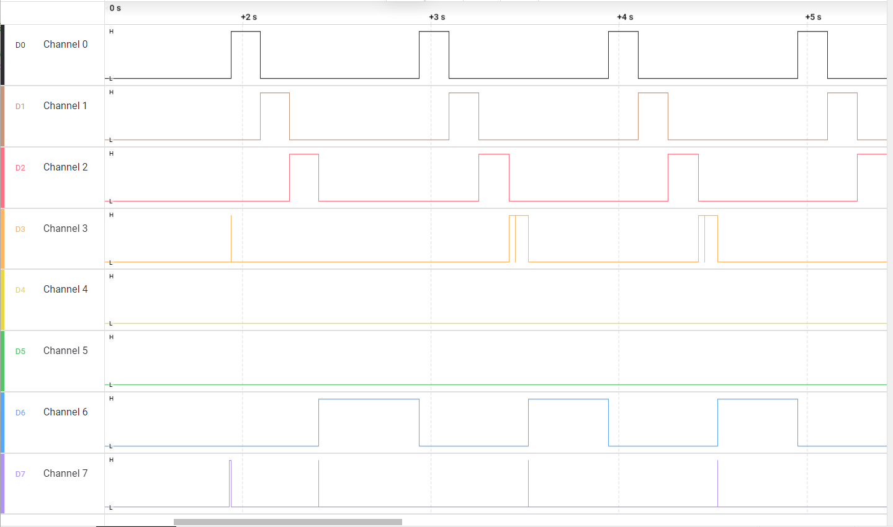
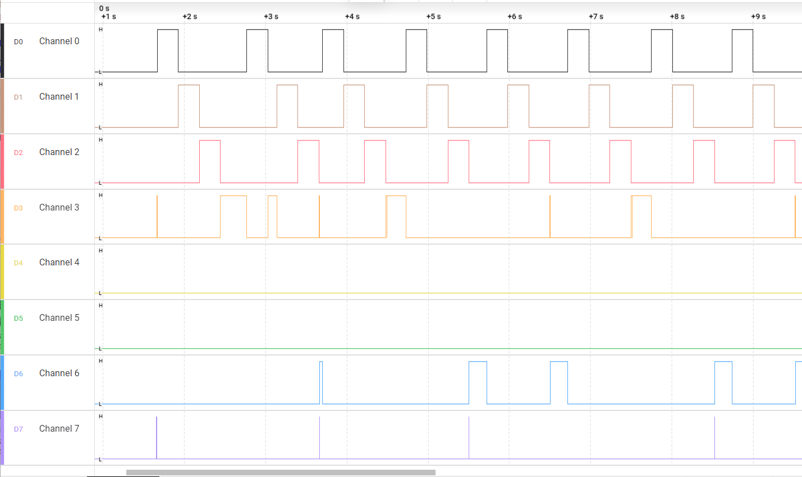
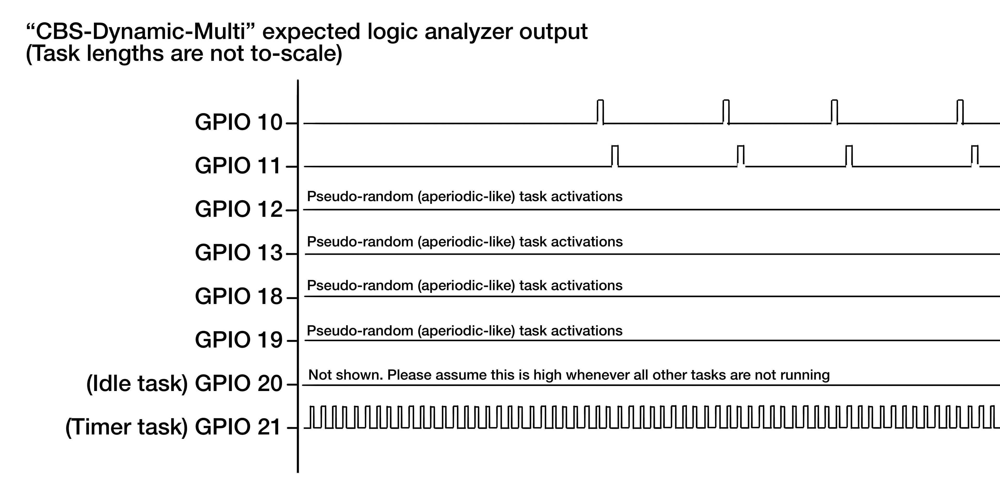
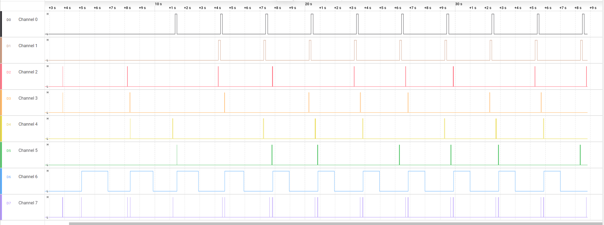

# CBS (Constant Bandwidth Server) - Testing Document

## 1. Testing Methodology

The CBS tests are organized around three discrete executable scenarios. Each one targets a different behavior of the CBS path in the kernel: a normal periodic/aperiodic mix, an overloaded variant, and a dynamic-arrival variant. All three depend on the same observability pattern:

1. GPIO pins are toggled by context-switch hooks (`traceTASK_SWITCHED_IN` / `traceTASK_SWITCHED_OUT`) rather than by per-task sequential `gpio_put()` calls.
2. `printf()` traces record release times, start/end ticks, and trigger times.
3. `xTaskNotifyGive()` is used to release the CBS task from a separate trigger task.
4. `vTaskDelayUntilNextPeriod()` is used by the periodic tasks so that the tests exercise periodic EDF behavior rather than ad hoc delays.

The pass criteria are not framed as generic CBS theory alone; they are tied to the attached programs and the load they create.

### 1.1 Logic-analyzer setup (CBS)

Common system-task channels in CBS tests:
- Idle task: GPIO 20
- Timer daemon task: GPIO 21

Workload channels by test binary:
- `main_cbs_test.c`: periodic task channels on GPIO 10..12, CBS worker on GPIO 13.
- `main_cbs_test_overrun.c`: periodic task channels on GPIO 10..12, CBS worker on GPIO 13.
- `main_cbs_test_dynamic_multi.c`: runtime-added periodic tasks `PERIODIC_10..11` on GPIO 10..11, and `CBS_0..3` on GPIO 12,13,18,19.

## 2. Test Cases

### Test 1: Baseline CBS behaviour
**File:** [main_cbs_test.c](FreeRTOS/FreeRTOS/Demo/ThirdParty/Community-Supported-Demos/CORTEX_M0+_RP2040/Standard/main_cbs_test.c)

**What it tests:**
This is the reference CBS scenario. It creates three periodic EDF tasks at startup, one CBS-managed aperiodic task, and one trigger task that periodically notifies the CBS task. The purpose is to show that a CBS server with modest load can coexist with periodic EDF work.

**Key setup from the program:**
1. Three periodic tasks on GPIO 10, 11, and 12.
2. One CBS task on GPIO 13.
3. Periodic workload: 1000 ms period, 150 ms WCET.
4. CBS server: 1000 ms period, 150 ms budget.
5. CBS trigger task wakes roughly every 700 ms.

**Expected result:**
The periodic tasks should continue to execute once per period without overrunning their budgets, and the CBS task should only run when notified. Because the combined load is intentionally below 100%, no deadline misses are expected in a correct build.

CBS baseline ideal logic analyzer output:

**Pass criterion:**
- All three periodic tasks keep producing regular GPIO pulses.
- The CBS task prints one start/end pair per notification.
- The CBS task never runs for longer than its configured budget in a single server period.

**Results (referencing `test_results/run_cbs_basic.log`):**
- The log shows all three periodic tasks being admitted at tick 0 and then releasing/finishing regularly.
- CBS jobs execute repeatedly with consistent start/end prints (`job=1` through `job=12` in the captured segment).
- CBS budget tracking lines stay within the configured server budget behavior, and no instability is visible.

### Test 2: System overload (deadline-miss behaviour test)
**File:** [main_cbs_test_overrun.c](FreeRTOS/FreeRTOS/Demo/ThirdParty/Community-Supported-Demos/CORTEX_M0+_RP2040/Standard/main_cbs_test_overrun.c)

**What it tests:**
This variant is a heavier load version of the same CBS pattern. It increases both the periodic WCET and the CBS WCET, then uses a periodic task to opportunistically notify the CBS task only when the previous CBS job has finished. The code also uses `bIsCBSFinished` as a guard so a new notification is not issued while the CBS server is still busy.

**Key setup from the program:**
1. Three periodic tasks on GPIO 10, 11, and 12.
2. One CBS task on GPIO 13.
3. Periodic workload: 1000 ms period, 250 ms WCET.
4. CBS server: 1000 ms period, 400 ms budget.
5. CBS trigger happens from inside the periodic task path when enough time has elapsed.
6. CBS WCET is 300 ms, which intentionally pushes the system closer to saturation.

**Expected result:**
This test is meant to stress the CBS implementation, so we should see deadline misses. We have a trace in our EDF logic for this: `[drop] task=<task_name> missed_deadline=...`

**Pass criterion:**
- The `bIsCBSFinished` guard prevents overlapping CBS jobs.
- The CBS task still prints sensible start/end tick pairs.
- The system does not deadlock or stop issuing periodic GPIO activity.

**Results (referencing `test_results/run_cbs_overrun.log`):**
- The system remains running under heavier load, and periodic tasks continue to release/finish.
- CBS executes long jobs and the kernel logs repeated CBS deadline-drop events (`[drop] task=CBS missed_deadline=...`), which is expected for this stress setup.
- No deadlock or scheduler collapse is observed in the captured run.

### Test 3: High system load and dynamically adding more tasks
**File:** [main_cbs_test_dynamic_multi.c](FreeRTOS/FreeRTOS/Demo/ThirdParty/Community-Supported-Demos/CORTEX_M0+_RP2040/Standard/main_cbs_test_dynamic_multi.c)

**What it tests:**
This is the dynamic admission test. It starts with a large periodic task set, then adds more periodic tasks later while the CBS tasks are already active. The goal is to verify that CBS keeps working when the ready set changes after the scheduler has started.

**Key setup from the program:**
1. Ten initial periodic tasks.
2. Four more periodic tasks are created later by a dispatcher task.
3. Two CBS tasks are created at startup and two more are created later.
4. One trigger task round-robins notifications across all CBS tasks.
5. Initial periodic tasks do not use GPIO pins.
6. Only subsequent periodic tasks `PERIODIC_10` and `PERIODIC_11` are visible on GPIO 10..11.
7. `CBS_0..3` are visible on GPIO 12, 13, 18, and 19.
8. Idle and timer system tasks use GPIO 20 and GPIO 21.
9. CBS server parameters are identical for all CBS tasks: 1000 ms period, 200 ms budget.

**Pin map used by the program:**
- Initial periodic tasks do not get GPIO pins.
- Subsequent periodic tasks 10..11 use GPIO 10..11.
- `CBS_0..3` use GPIO 12,13,18,19.
- Idle uses GPIO 20 and timer daemon uses GPIO 21.

**Expected result:**
The test should demonstrate that CBS continues to function while new EDF tasks are created after startup. The dispatcher should print creation messages for the later tasks, and the CBS trigger task should continue to notify whichever CBS worker is next in the round-robin order.

Expected logic analyzer output:

**Pass criterion:**
- The dispatcher creates the four later periodic tasks successfully.
- The dispatcher creates two later CBS tasks successfully (for four CBS tasks total).
- The CBS trigger task continues to notify all four CBS workers over time.
- The trace output reflects all 14 periodic tasks plus the four CBS tasks without kernel instability.

**Results (referencing `test_results/run_cbs_dynamic_multi.log`):**
- Startup matches the updated program: 10 initial periodic tasks and 2 initial CBS tasks.
- Runtime additions are visible in order: `PERIODIC_10`, `PERIODIC_11`, `PERIODIC_12`, `PERIODIC_13`, then `CBS_2` and `CBS_3`.
- The dispatcher reports completion and self-deletes, and all four CBS workers (`CBS_0`..`CBS_3`) show round-robin jobs in subsequent output.
- Periodic release/finish traces continue after dynamic additions, indicating stable operation at high load.

