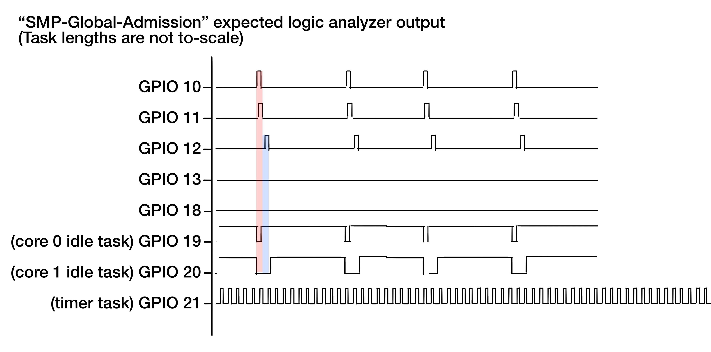
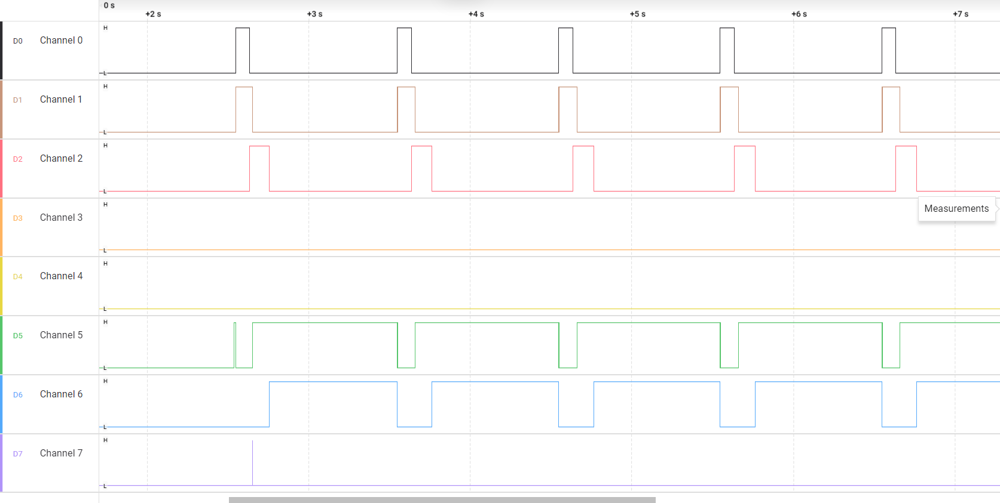
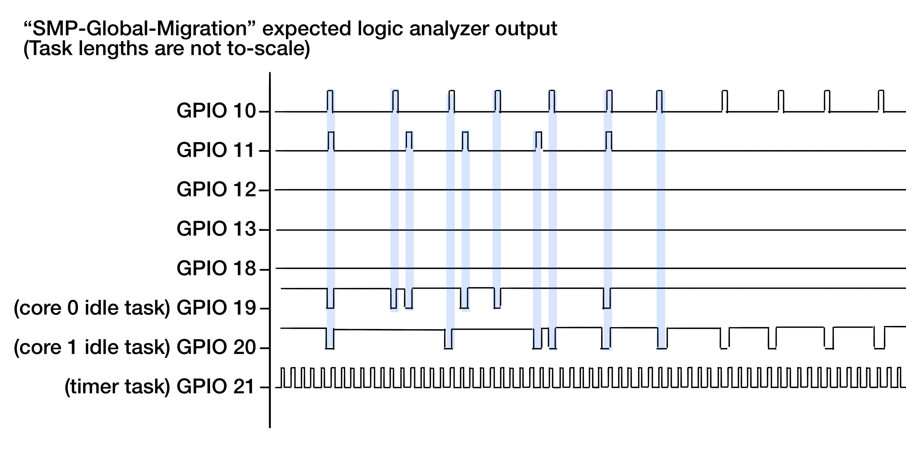
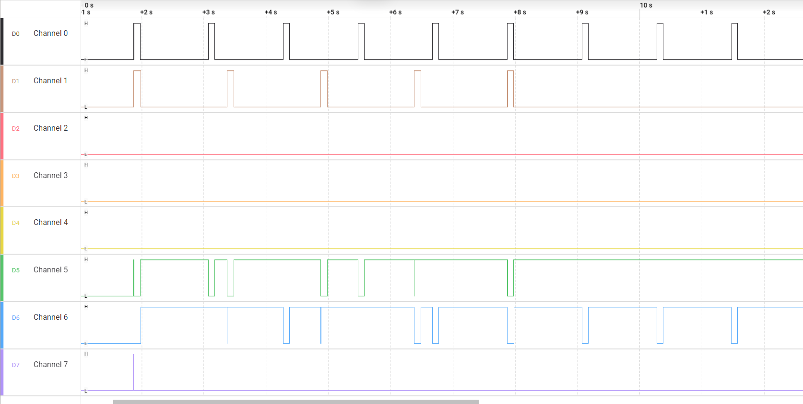
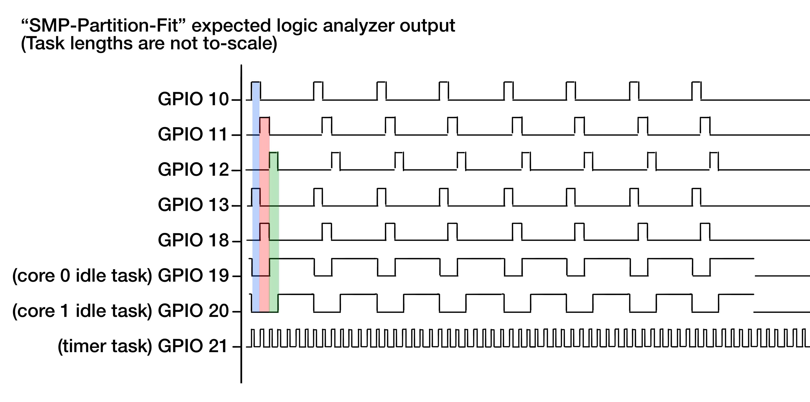
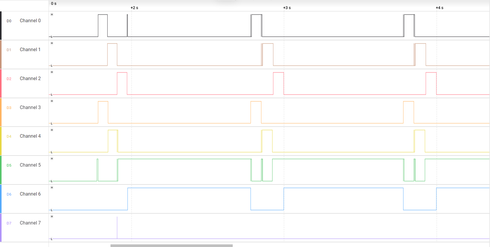
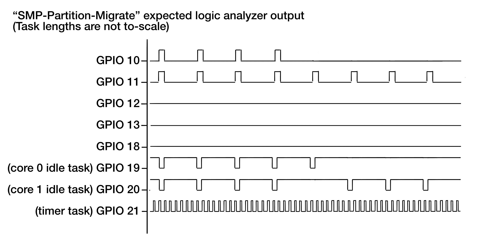
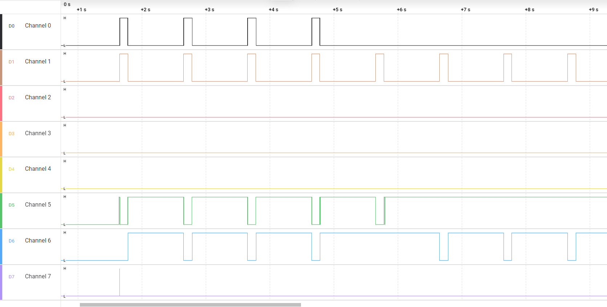

# SMP (Multiprocessor EDF) - Testing Document

## 1. Testing Methodology

The SMP test suite is split into four discrete executables. Two tests exercise global EDF behavior and two tests exercise partitioned EDF behavior. The tests are intentionally small and focused so each one isolates a single scheduler capability instead of mixing multiple behaviors into one run.

Each test uses the same observation pattern:

1. GPIO pins are toggled by context-switch hooks (`traceTASK_SWITCHED_IN` / `traceTASK_SWITCHED_OUT`) instead of in-task sequential `gpio_put()` calls.
2. `printf()` traces record admission results, core changes, and timing.
3. `xTaskGetTickCount()` is used to anchor migration and removal events in time.
4. The RP2040 dual-core setup validates the SMP-specific code paths rather than a single-core fallback.

### 1.1 Logic-analyzer setup (SMP)

SMP system-task channels are shared across all SMP tests:
- Core 0 idle task: GPIO 19
- Core 1 idle task: GPIO 20
- Timer daemon task: GPIO 21

Idle ordering has been verified from the current source registration order: `xTaskGetIdleTaskHandleForCore(0)` is mapped to GPIO 19, and `xTaskGetIdleTaskHandleForCore(1)` is mapped to GPIO 20.

Workload channels by test:
- `main_smp_global_test_admission.c`: `G_A`=10, `G_B`=11, `G_C`=12, `G_REJECT`=13.
- `main_smp_global_test_migration.c`: `G_HINT`=10, `G_PEER`=11.
- `main_smp_partition_test_fit.c`: `P_U40`=10, `P_U30A`=11, `P_U30B`=12, `P_U25A`=13, `P_U25B`=18.
- `main_smp_partition_test_migration.c`: `P_A_U70`=10, `P_B_U40`=11.

Expected pin behavior:
- Workload pins should pulse while their tasks are running and show migration-related movement only in the migration tests.
- GPIO 19 and 20 should indicate idle residency on core 0 and core 1 respectively when those cores have no runnable EDF work.
- GPIO 21 should show brief timer-daemon activity bursts.

## 2. Global EDF Tests

### Test 1: Global admission control
**File:** [main_smp_global_test_admission.c](FreeRTOS/FreeRTOS/Demo/ThirdParty/Community-Supported-Demos/CORTEX_M0+_RP2040/Standard/main_smp_global_test_admission.c)

**What it tests:**
This program verifies that the global EDF admission path accepts a schedulable task set and rejects an oversized task. It is the basic smoke test for the global EDF admission controller.

**Program setup:**
- `G_A` on GPIO 10 with 80 ticks of work.
- `G_B` on GPIO 11 with 100 ticks of work.
- `G_C` on GPIO 12 with 120 ticks of work.
- `G_REJECT` on GPIO 13 with 900 ticks of work.
- All tasks use a 1000-tick period and identical deadlines.

**Expected result:**
The first three tasks are admitted and continue to run periodically. The final task is rejected because it makes the task set unschedulable under the global EDF admission test.

Logic analyzer output:

Note that the blue and red stripes indicate timing of job runs & corresponding dips in idle task execution

**Pass criterion:**
- `uxTaskGetEDFAdmittedCount()` reaches 3.
- `uxTaskGetEDFRejectedCount()` increments for the rejection case.
- The admitted tasks keep producing periodic GPIO activity without kernel instability.

**Results (from `test_results/run_smp_global_admission.log`):**
- The log shows `G_A`, `G_B`, and `G_C` admitted, and `G_REJECT` rejected by global GFB admission.
- The startup summary reports `admitted=3 rejected=1`.
- Admitted tasks continue to release and finish periodically for the remainder of the captured output.

---

### Test 2: Global migration and remove-from-core flow
**File:** [main_smp_global_test_migration.c](FreeRTOS/FreeRTOS/Demo/ThirdParty/Community-Supported-Demos/CORTEX_M0+_RP2040/Standard/main_smp_global_test_migration.c)

**What it tests:**
This test validates the runtime migration and release APIs in global EDF mode. A controller task changes the placement of one task and removes another task from a fixed core assignment.

**Program setup:**
- `G_HINT` is created with `xTaskCreateEDFOnCore(..., 0, ...)` so it starts with a core-0 hint.
- `G_PEER` is created with `xTaskCreateEDF(...)` so it starts as a normal global EDF task.
- The worker logs any observed core changes through `get_core_num()`.
- A controller waits 3 seconds, migrates `G_HINT` to core 1, waits another 3 seconds, and then calls `vTaskRemoveFromCore()` on `G_PEER`.

**Expected result:**
The migration request should succeed and the hinted task should become eligible to run on the new core. Removing the peer task from its core assignment should release it back into the global pool.

Logic analyzer output:

Note again that blue stripes indicate task timing. 

**Pass criterion:**
- The controller prints a successful migration result.
- The worker trace eventually shows `G_HINT` on core 1.
- The remove-from-core operation completes without a crash.

**Results (from `test_results/run_smp_global_migration.log`):**
- The controller logs `migrate hinted->core1 result=1`, then worker output later confirms `G_HINT` running on core 1.
- The controller logs removal of `G_PEER` from scheduling.
- After removal, only `G_HINT` continues periodic releases/finishes, with no crash observed.

## 3. Partitioned EDF Tests

### Test 3: Partitioned fit/reject assignment
**File:** [main_smp_partition_test_fit.c](FreeRTOS/FreeRTOS/Demo/ThirdParty/Community-Supported-Demos/CORTEX_M0+_RP2040/Standard/main_smp_partition_test_fit.c)

**What it tests:**
This program validates the partitioned EDF admission path using a fit/reject scenario. It checks that the partitioning heuristic accepts a task set that fits across the available cores and rejects a task that does not.

**Program setup:**
- `P_U40` with 60 ticks of work and utilization 0.40.
- `P_U30A` with 60 ticks of work and utilization 0.30.
- `P_U30B` with 60 ticks of work and utilization 0.30.
- `P_U25A` with 60 ticks of work and utilization 0.25.
- `P_U25B` with 60 ticks of work and utilization 0.25.
- `P_U80_REJECT` with 800 ticks of work and utilization 0.80.

**Expected result:**
The five moderate tasks are admitted and placed across the two cores. The oversized task is rejected because no core has enough remaining capacity.

Logic analyzer expected output:

Again, the red/blue/green stripes indicate job timing and how they correspond to idle task execution.

**Pass criterion:**
- Five tasks are admitted.
- One task is rejected.
- The summary print shows 5 admitted and 1 rejected.

**Results (from `test_results/run_smp_partition_fit.log`):**
- The log shows five accepts (`P_U40`, `P_U30A`, `P_U30B`, `P_U25A`, `P_U25B`) and one reject (`P_U80_REJECT`).
- The printed summary confirms `admitted=5 rejected=1`.
- Accepted tasks continue periodic release/finish behavior in the captured run.

---

### Test 4: Partitioned migration and capacity release
**File:** [main_smp_partition_test_migration.c](FreeRTOS/FreeRTOS/Demo/ThirdParty/Community-Supported-Demos/CORTEX_M0+_RP2040/Standard/main_smp_partition_test_migration.c)

**What it tests:**
This test validates the partitioned migration and remove-from-core APIs. It demonstrates that a task cannot be migrated onto an overloaded core, then shows that the migration succeeds after another task is removed and capacity becomes available.

**Program setup:**
- `P_A_U70` is created on core 0 with 120 ticks of work and utilization 0.70.
- `P_B_U40` is created on core 1 with 120 ticks of work and utilization 0.40.
- A controller waits 3 seconds, tries to move `P_B_U40` to core 0, removes `P_A_U70` from core assignment, waits 1 second, and then retries the migration.
- The worker task logs any observed core changes through `get_core_num()`.

**Expected result:**
The first migration should fail because core 0 is already carrying a large task. After `P_A_U70` is removed from its fixed core, the second migration should succeed.

Logic analyzer expected output:

**Pass criterion:**
- The first migration request returns failure.
- The controller reports that `P_A_U70` was removed from core assignment.
- The second migration request returns success.

**Results (from `test_results/run_smp_partition_migrate.log`):**
- The first migration attempt logs failure as expected: `migrate B->core0 expect fail result=0`.
- The controller then logs removal of `P_A_U70` from core assignment.
- The second migration logs success: `migrate B->core0 after remove expect pass result=1`, and worker output then shows `P_B_U40` running on core 0.

## 4. Coverage Summary

The four attached SMP tests cover the externally visible behavior of the implementation:

- global EDF admission control,
- global EDF migration and removal,
- partitioned EDF fit/reject assignment,
- partitioned EDF migration after capacity is released.

Each test is discrete and intentionally limited in scope so the behavior under test is easy to interpret.
